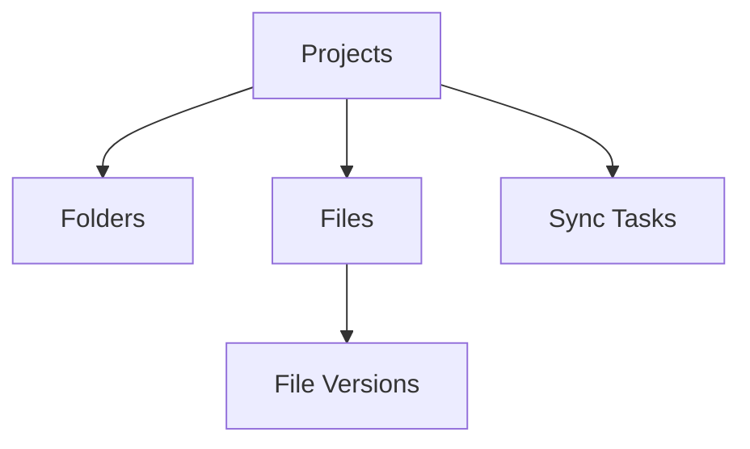

# 优化的MongoDB数据库设计

基于方案1（优化的单次遍历）+ 方案2（优化的数据库设计）的组合，为ACC文件同步系统设计的高性能MongoDB数据库架构。

## 📋 目录

- [设计概述](#设计概述)
- [数据库架构](#数据库架构)
- [集合设计](#集合设计)
- [索引策略](#索引策略)
- [数据访问层](#数据访问层)
- [同步策略](#同步策略)
- [使用指南](#使用指南)
- [性能优化](#性能优化)

## 🎯 设计概述

### 核心目标
- **高性能**: 优化的索引和查询策略
- **可扩展**: 支持大规模项目数据
- **灵活性**: 支持多种查询模式
- **一致性**: 统一的数据结构和访问接口

### 设计原则
1. **扁平化存储**: 避免深层嵌套，提高查询效率
2. **冗余优化**: 适度冗余关键字段，减少关联查询
3. **索引优先**: 基于查询模式设计索引
4. **批量操作**: 支持高效的批量数据操作

## 🏗️ 数据库架构

### 集合概览
```
acc_sync_db/
├── projects/           # 项目基本信息
├── folders/           # 文件夹数据（扁平化）
├── files/             # 文件数据（扁平化）
├── file_versions/     # 文件版本历史
├── sync_tasks/        # 同步任务记录
└── system_config/     # 系统配置
```

### 数据关系


## 📊 集合设计

### 1. Projects 集合
存储项目基本信息和统计数据。

```javascript
{
  "_id": "b.1eea4119-3553-4167-b93d-3a3d5d07d33d",
  "name": "项目名称",
  "description": "项目描述",
  "hub_id": "hub_id",
  "account_id": "account_id",
  "status": "active",
  
  "sync_info": {
    "last_sync_time": ISODate(),
    "sync_status": "completed",
    "sync_duration_seconds": 120.5,
    "sync_error": null,
    "sync_version": "1.0.0"
  },
  
  "statistics": {
    "total_folders": 1500,
    "total_files": 15000,
    "total_size_bytes": 1073741824,
    "max_depth": 8,
    "file_types_count": {"pdf": 5000, "dwg": 3000, "rvt": 2000},
    "last_calculated": ISODate()
  }
}
```

### 2. Folders 集合
扁平化存储文件夹数据，包含路径和层级信息。

```javascript
{
  "_id": "urn:adsk.wipprod:fs.folder:co.xxx",
  "project_id": "b.1eea4119-3553-4167-b93d-3a3d5d07d33d",
  "name": "Design Documents",
  "display_name": "Design Documents",
  "parent_id": "parent_folder_id",
  
  // 路径信息（优化查询）
  "path": "/Project Files/Design/Architectural",
  "path_segments": ["Project Files", "Design", "Architectural"],
  "depth": 2,
  
  // 基本元数据
  "metadata": {
    "create_time": ISODate(),
    "create_user_id": "user123",
    "create_user_name": "张三",
    "last_modified_time": ISODate(),
    "object_count": 25,
    "size": 1048576,
    "hidden": false
  },
  
  // 子项统计
  "children_stats": {
    "direct_folders": 5,
    "direct_files": 20,
    "total_folders": 15,
    "total_files": 150,
    "total_size": 104857600,
    "last_calculated": ISODate()
  },
  
  // 索引优化字段
  "project_path": "project_id#/Project Files/Design/Architectural"
}
```

### 3. Files 集合
扁平化存储文件数据，包含当前版本和摘要信息。

```javascript
{
  "_id": "urn:adsk.wipprod:dm.lineage:xxx",
  "project_id": "b.1eea4119-3553-4167-b93d-3a3d5d07d33d",
  "name": "建筑图纸.dwg",
  "parent_folder_id": "folder_id",
  
  // 路径信息
  "folder_path": "/Project Files/Design/Architectural",
  "full_path": "/Project Files/Design/Architectural/建筑图纸.dwg",
  "depth": 3,
  
  // 文件类型信息
  "file_info": {
    "file_type": "dwg",
    "mime_type": "application/acad",
    "category": "drawing"
  },
  
  // 当前版本（快速访问）
  "current_version": {
    "version_id": "version_urn",
    "version_number": 3,
    "file_size": 2048576,
    "urn": "version_urn",
    "review_state": "approved",
    "create_time": ISODate()
  },
  
  // 版本摘要
  "versions_summary": {
    "total_versions": 3,
    "latest_version_number": 3,
    "has_review_states": true
  },
  
  // 索引优化字段
  "project_folder": "project_id#/Project Files/Design/Architectural",
  "project_type": "project_id#dwg",
  "name_lower": "建筑图纸.dwg"
}
```

### 4. File Versions 集合
独立存储文件版本历史，支持详细的版本查询。

```javascript
{
  "_id": "urn:adsk.wipprod:dm.version:xxx",
  "file_id": "file_id",
  "project_id": "project_id",
  "version_number": 3,
  
  // URN信息
  "urn": "version_urn",
  "item_urn": "item_urn",
  "storage_urn": "storage_urn",
  "lineage_urn": "lineage_urn",
  
  // Review信息
  "review_info": {
    "review_state": "approved",
    "approval_status": {...},
    "review_workflow_id": "workflow_id",
    "reviewers": [...]
  },
  
  // 元数据
  "metadata": {
    "file_size": 2048576,
    "storage_size": 2048576,
    "mime_type": "application/acad",
    "create_time": ISODate()
  }
}
```

## 🔍 索引策略

### 主要索引

#### Folders 集合
```javascript
// 项目路径查询（复合索引）
{"project_id": 1, "path": 1}

// 父文件夹查询
{"parent_id": 1}

// 层级查询
{"project_id": 1, "depth": 1}

// 文本搜索
{"name": "text", "display_name": "text"}
```

#### Files 集合
```javascript
// 项目文件夹查询（复合索引）
{"project_id": 1, "folder_path": 1}

// 文件类型查询
{"project_id": 1, "file_info.file_type": 1}

// Review状态查询
{"current_version.review_state": 1}

// URN查询
{"current_version.urn": 1}

// 文件名搜索
{"name_lower": 1}
```

#### File Versions 集合
```javascript
// 文件版本查询（复合索引）
{"file_id": 1, "version_number": -1}

// URN查询
{"urn": 1}

// Review状态查询
{"project_id": 1, "review_info.review_state": 1}
```

## 💻 数据访问层

### 核心类

#### DataAccessLayer
提供高级数据操作接口：

```python
from database.data_access_layer import DataAccessLayer

dal = DataAccessLayer()

# 项目操作
dal.create_or_update_project(project_data)
dal.get_project(project_id)
dal.list_projects()

# 文件夹操作
dal.batch_upsert_folders(folders_data)
dal.get_folders_by_project(project_id)
dal.search_folders(project_id, search_text)

# 文件操作
dal.batch_upsert_files(files_data)
dal.search_files(project_id, search_text, file_types)
dal.get_files_by_review_state(project_id, review_state)

# 统计分析
dal.get_project_statistics(project_id)
```

### 批量操作优化
- 使用MongoDB的`bulk_write`进行批量操作
- 支持并行处理和错误恢复
- 自动添加索引优化字段

## 🔄 同步策略

### 数据转换器
将ACC API数据转换为优化的数据库格式：

```python
from database.data_sync_strategy import DataTransformer

# 转换文件夹数据
db_folder = DataTransformer.transform_folder_data(
    api_data=api_folder_data,
    project_id=project_id,
    parent_id=parent_id,
    path=path,
    depth=depth
)

# 转换文件数据
db_file = DataTransformer.transform_file_data(
    api_data=api_file_data,
    project_id=project_id,
    parent_folder_id=parent_folder_id,
    folder_path=folder_path
)
```

### 同步策略类型
1. **完全同步**: 同步整个项目的所有数据
2. **增量同步**: 只同步变更的数据
3. **文件夹同步**: 只同步文件夹结构
4. **版本同步**: 只同步文件版本信息

## 📖 使用指南

### 1. 数据库初始化

```python
from database.db_initialization import initialize_database

# 初始化数据库（创建集合和索引）
success = initialize_database(drop_existing=False)
```

### 2. 数据同步

```python
from database.data_sync_strategy import SyncManager, FullSyncStrategy

# 创建同步管理器
sync_manager = SyncManager()

# 创建完全同步策略
full_sync = FullSyncStrategy()

# 执行同步
task_id = sync_manager.create_sync_task(
    strategy=full_sync,
    project_id="your_project_id",
    max_depth=10
)

success = sync_manager.execute_sync(task_id)
```

### 3. 数据查询

```python
from database.data_access_layer import get_dal

dal = get_dal()

# 获取项目文件夹树
folders = dal.get_folder_tree(project_id)

# 搜索PDF文件
pdf_files = dal.search_files(
    project_id=project_id,
    file_types=["pdf"],
    search_text="设计图纸"
)

# 获取已审批的文件
approved_files = dal.get_files_by_review_state(
    project_id=project_id,
    review_state="approved"
)
```

## ⚡ 性能优化

### 查询优化
1. **使用复合索引**: 针对常用查询模式设计复合索引
2. **避免全表扫描**: 查询条件包含索引字段
3. **限制结果集**: 使用`limit()`限制返回数据量
4. **投影查询**: 只查询需要的字段

### 写入优化
1. **批量操作**: 使用`bulk_write`进行批量插入/更新
2. **并行处理**: 使用线程池并行处理
3. **索引优化**: 在批量操作前禁用索引，完成后重建

### 存储优化
1. **数据压缩**: 使用MongoDB的压缩功能
2. **分片策略**: 大型部署使用分片
3. **定期清理**: 清理过期的同步任务和日志

## 🧪 测试

运行完整的数据库测试：

```bash
python test_optimized_database.py
```

测试内容包括：
- 数据库连接测试
- 数据库初始化测试
- 数据访问层测试
- 数据转换器测试
- 性能测试

## 📈 监控和维护

### 性能监控
- 查询执行时间
- 索引使用情况
- 内存和磁盘使用
- 并发连接数

### 定期维护
- 重建索引
- 压缩集合
- 清理旧数据
- 备份数据库

## 🔧 配置文件

主要配置文件：
- `mongodb_config.py`: 数据库连接配置
- `optimized_schema_design.py`: 数据库架构设计
- `db_initialization.py`: 数据库初始化
- `data_access_layer.py`: 数据访问层
- `data_sync_strategy.py`: 同步策略

## 📝 注意事项

1. **暂不包含权限信息**: 当前设计专注于文件和文件夹数据，权限信息将在后续版本中添加
2. **兼容现有API**: 设计保持与现有API的兼容性
3. **扩展性**: 架构支持未来功能扩展
4. **数据一致性**: 使用事务保证关键操作的一致性

## 🚀 下一步计划

1. 集成到现有API中
2. 添加权限信息支持
3. 实现实时同步
4. 添加数据分析功能
5. 性能调优和优化
