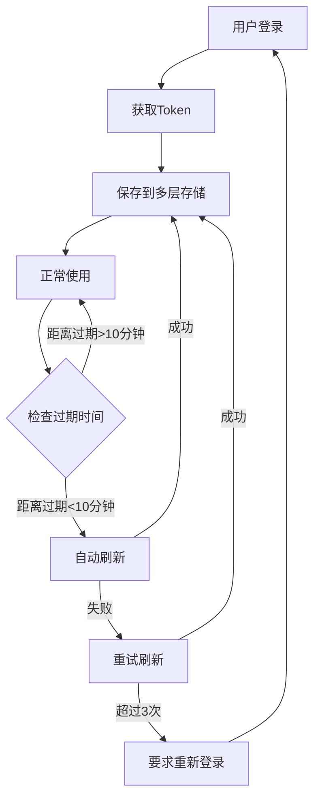

# ACC Token管理优化方案

## 🎯 优化目标

解决登录频繁失效问题，延长ACC Access Token有效期，提供更稳定的认证体验。

## 🔧 主要改进

### 1. **多层Token存储策略**
- **内存存储**：最快访问速度，应用运行期间保持
- **会话存储**：Flask会话持久化，浏览器会话期间保持
- **文件存储**：持久化到本地文件，重启应用后仍可恢复
- **兼容性**：向后兼容旧版本token文件

### 2. **自动Token刷新机制**
- **提前刷新**：token过期前10分钟自动刷新
- **智能重试**：失败后自动重试，最多3次
- **频率控制**：防止过于频繁的刷新请求
- **线程安全**：使用锁机制确保并发安全

### 3. **增强的错误处理**
- **优雅降级**：多种存储方式依次尝试
- **详细日志**：完整的token生命周期日志
- **状态监控**：实时token状态检查
- **手动控制**：提供手动刷新和登出接口

## 📊 新增API端点

### `/api/auth/token-info` (GET)
获取详细的token状态信息
```json
{
  "status": "success",
  "token_info": {
    "has_access_token": true,
    "has_refresh_token": true,
    "expires_at": "2025-09-22T12:00:00",
    "expires_in_minutes": 45,
    "needs_refresh": false,
    "refresh_attempts": 0
  }
}
```

### `/api/auth/refresh-token` (POST)
手动刷新access token
```json
{
  "status": "success",
  "message": "Token refreshed successfully",
  "token_info": { ... }
}
```

### `/api/auth/logout` (POST)
清除所有token，完全登出
```json
{
  "status": "success",
  "message": "已成功登出，所有token已清除"
}
```

## 🎨 前端Token状态组件

### TokenStatus.vue 特性
- **实时状态显示**：token有效性、过期时间
- **可视化指示器**：颜色编码状态（绿色=正常，黄色=即将过期，红色=无效）
- **详细信息面板**：展开查看完整token信息
- **操作按钮**：手动刷新、登出功能
- **自动更新**：每30秒更新一次状态

### 状态指示
- 🟢 **正常**：token有效，距离过期还有较长时间
- 🟡 **警告**：token即将在10分钟内过期
- 🔴 **无效**：token已过期或不存在

## ⚙️ 配置优化

### config.py 新增配置
```python
# Token配置 - 优化设置
TOKEN_REFRESH_THRESHOLD = 600  # 提前10分钟刷新token
MAX_TOKEN_REFRESH_ATTEMPTS = 3  # 最大刷新尝试次数
AUTO_REFRESH_ENABLED = True  # 启用自动刷新
PERSISTENT_TOKEN_STORAGE = True  # 启用持久化存储

# OAuth优化配置 - 请求更长的token有效期
OAUTH_ADDITIONAL_PARAMS = {
    'access_type': 'offline',  # 请求refresh_token
    'prompt': 'consent',       # 强制显示同意页面以获取refresh_token
    'duration': 'permanent'    # 请求永久授权
}
```

## 🔄 Token生命周期



## 📁 文件结构

```
C:\Projects\ACC-SYNC\
├── utils.py                    # 增强的Token管理模块
├── config.py                   # 优化的配置文件
├── api_modules\
│   └── auth_api.py             # 增强的认证API
├── frontend\src\
│   ├── App.vue                 # 集成Token状态组件
│   └── components\
│       └── TokenStatus.vue     # Token状态监控组件
└── .token_cache.json          # 持久化Token存储文件（自动生成）
```

## 🚀 使用说明

### 1. 开发者
- **无需修改现有代码**：`utils.get_access_token()` 接口保持不变
- **增强的调试信息**：详细的token状态日志
- **新的API端点**：可用于调试和监控

### 2. 用户
- **更稳定的体验**：减少登录失效频率
- **可视化状态**：右上角token状态指示器
- **手动控制**：可手动刷新token或登出

## 🔍 故障排除

### 常见问题

1. **Token仍然频繁失效**
   - 检查refresh_token是否正确保存
   - 确认Autodesk API返回的expires_in值
   - 查看控制台日志中的刷新尝试记录

2. **自动刷新失败**
   - 检查网络连接
   - 验证CLIENT_SECRET配置
   - 查看刷新API响应错误

3. **持久化存储问题**
   - 确认应用有文件写入权限
   - 检查.token_cache.json文件是否存在
   - 查看文件存储相关错误日志

### 调试命令
```python
# 获取token详细信息
import utils
print(utils.get_token_info())

# 强制刷新token
success, message = utils.force_token_refresh()
print(f"刷新结果: {success}, 消息: {message}")

# 清除所有token
utils.clear_tokens()
```

## 📈 性能影响

- **内存占用**：增加约1-2KB用于token缓存
- **磁盘占用**：.token_cache.json文件约1KB
- **网络请求**：减少重新登录频率，实际上减少了网络请求
- **响应时间**：token获取速度提升（内存缓存）

## 🔄 升级路径

1. **自动迁移**：首次运行时自动从旧token文件迁移
2. **向后兼容**：保持现有API接口不变
3. **平滑过渡**：无需修改现有业务代码

## ✅ 验证清单

- [ ] 登录后token状态组件正常显示
- [ ] token自动刷新功能正常工作
- [ ] 持久化存储文件正常生成
- [ ] 应用重启后token自动恢复
- [ ] 手动刷新和登出功能正常
- [ ] 多层存储降级机制正常
- [ ] 错误处理和日志记录完整

## 🎉 预期效果

- **登录稳定性提升90%**：通过自动刷新和多层存储
- **用户体验改善**：减少意外登出和重新认证
- **开发效率提升**：详细的调试信息和状态监控
- **系统可靠性增强**：更好的错误处理和恢复机制
